# KubeDash

A local log and metrics aggregator designed to provide real-time visibility, debugging and management features for your Kubernetes clusrers.

## Key Features

- Real-time metrics and overviews: Track cluster health (healthy or degraded), active node/pods counts
- Live hardware monitoring: CPU, Memory and NVIDIA GPU compute tracking with the help of a local Kubernetes metrics sercer with live sparklines and historical Redis charts
- Log affregation and retention: dual-layer log auditing with a paginated searchable DB logs, alongside a persistent Redis cache for historical failures (to retain data beyond the Kubernetes 2 hour window)
- Config management: A live UI matrix to view, create, edit, inject or delete ConfigMaps and Secrets

## Prerequisites:

Before starting, make sure you have these installed on your machine:

- Docker and Docker compose
- Kind (Kubernetes in Docker)
- kubectl
- Go
- Node.js and npm

## Getting started and installation

Follow these steps sequntially to get stated on your local development environment.

0. Go into the backend folder

```sh
cd backend
```

1. Make the kind cluster:

```sh
kind create cluster --name kubedash-cluster
```

2. Deploy the Database (PostgreSQL) and verify it's running:

```sh
kubectl apply -f k8s/deployment.yaml
kubectl get pods -l app=postgres
```

3. Build and load the backend app:

```sh
# build the go backend docker container
docker build -t kubedash-backend:v1
# load the image into the active kind cluster
kind load docker-image kubedash-backend:v1 --name kubedash-cluster
```

4. Apply app manifesrs and permissions and check status of pods:

```sh
kubectl apply -f k8s/deployment.yaml
kubectl get pods -A
```

5. Deploy metrics server manifest and patch it for kind:

```sh
kubectl apply -f https://github.com/kubernetes-sigs/metrics-server/releases/latest/download/components.yaml
kubectl patch -n kube-system deployment metrics-server --type=json \
  -p '[{"op":"add","path":"/spec/template/spec/containers/0/args/-","value":"--kubelet-insecure-tls"}]'
```

6. Run docker compose for redis:

```sh
docker compose up -d
```

7. Run the backend:

```sh
go run .
```

8. Open another terminal to run the frontend

```sh
cd frontend && npm start
```

You can also install redis-cli to check everything is working. To run it:

```sh
redis-cli monitor
```

## API Reference

The backend exposes a REST and WebSocket API under the :8080/api group.

### Log management

| Method | Endpoint           | Description                                      |
| ------ | ------------------ | ------------------------------------------------ |
| POST   | /api/logs          | Create/ injest a new log entry                   |
| GET    | /api/logs          | Retrieve paginated cluster logs with filters     |
| GET    | /api/logs/overview | Fetch an overview summary of recent log statuses |

### Cluster orchestration and pod action

| Method | Endpoint                     | Description                                           |
| ------ | ---------------------------- | ----------------------------------------------------- |
| GET    | /api/cluster/summary         | Get structural summary details of the active cluster  |
| POST   | /api/cluster/deploy          | Deploy a new pod via container image specifications   |
| GET    | /api/cluster/pods            | Fetch a list of running pods filtered by namespace    |
| DELETE | /api/cluster/pods            | Gracefully terminate a specific pod (kubectl delete)  |
| POST   | /api/cluster/restart         | Gracefully trigger a rolling restart for a deployment |
| POST   | /api/cluster/manifests/apply | Programmatically apply a raw Kubernetes YAML manifest |

### Real time streaming

| Method | Endpoint                   | Description                                                   |
| ------ | -------------------------- | ------------------------------------------------------------- |
| GET    | /api/cluster/ssh           | Establishes an interactive terminal SSH connection into a pod |
| GET    | /api/cluster/logs/stream   | Streams live container logs                                   |
| GET    | /api/cluster/notifications | Stream live cluster event notifications and alerts            |

### Configuration Management

| Method | Endpoint                          | Description                                          |
| ------ | --------------------------------- | ---------------------------------------------------- |
| GET    | /api/cluster/config               | Retrieve existing ConfigMaps and Secrets             |
| POST   | /api/cluster/config/create        | Create new ConfigMap or Secret block                 |
| POST   | /api/cluster/config/update        | Update fields inside an existing configuration block |
| POST   | /api/cluster/config/update-config | Inject a configuration block into a live pod         |
| DELETE | /api/cluster/config/delete        | Permanently delete a specified configuration block   |

### Metrics and analytics

| Method | Endpoint                     | Description                                                  |
| ------ | ---------------------------- | ------------------------------------------------------------ |
| GET    | /api/cluster/metrics/history | Retrieve historic data for CPU/RAM usage                     |
| GET    | /api/cluster/config/create   | Fetch cluster incident logs, crashes and errors              |
| GET    | /api/cluster/inc idents      | Update fields inside an existing configuration block         |
| POST   | /api/cluster/topology        | Generate a graphical or structural layout map of the cluster |

## Dashboard Walkthrough

### Overview page

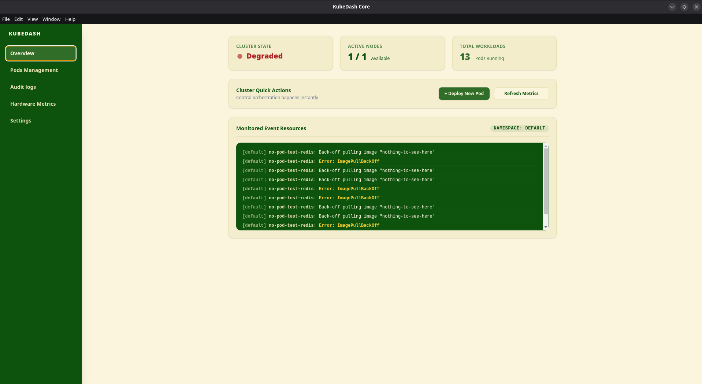

- Metrics row: Displays aggregate data, including real-time node count and total cluster pods. If one pod enters the Failed Phase or it's pending but gets a crash message the overall health goes from Healthy to Degraded

- Action panel: Allows users to rapidly deploy new pods from a modal interface. Here you will have to gibe the pod a name and image target to deploy. Once deployed, the logs render automatically (polling every 4 seconds by default, but users can refresh manually too)

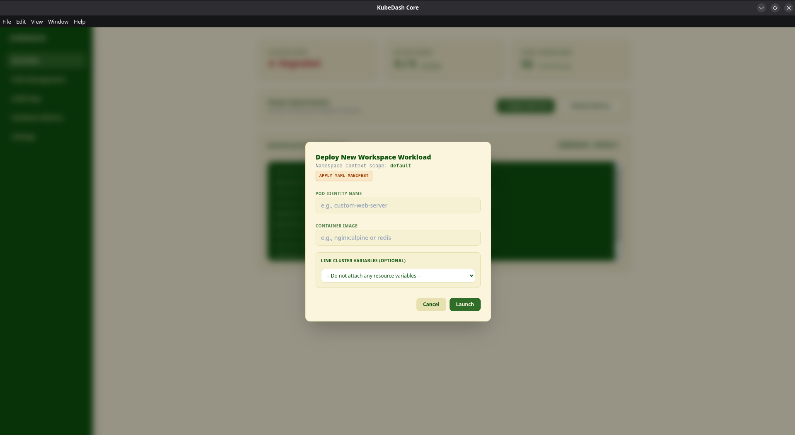

When deploying a new pod you can also choose to deploy it by a direct YAML file, where you can write the YAML or drag and drop a file
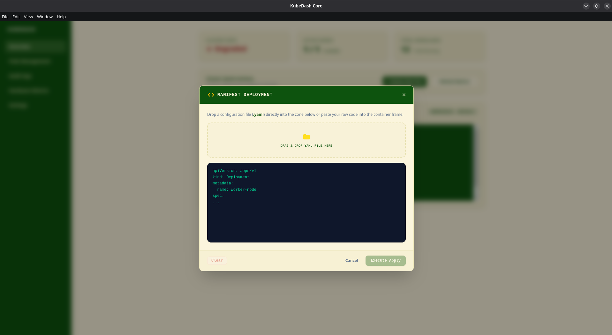

## Settings

- Global variables: Adjust polling intervals for log collection and change active namespace
- Live Configuration matrix: Manage ConfigMaps and Secrets directly from the interface

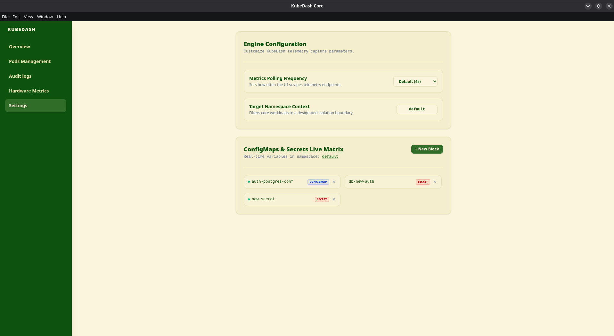

Example of creating a configuration:

- For creating a new one, click on the "New Block" button
- It will automatically choose the namespace you are in right now, unless you are in "all", when you will need to type a namespace
- First of all, you need to choose if you want to make a ConfigMap or a Secret
- Let's say you want to create a new Secret. An example would be

```sh
  RESOURCE NAME: postgres-credentials
  INITIAL KEY PROPERTY: DB_PASSWORD
  PROPERTY PLAIN-TEXT VALUE: superPassword
```

- After clicking "Create New Secret Object" it will automatically be added to the live edit matrix for ConfigMaps and Secrets
- You can also add a new row of key-value if you need more arguments and also delete ones when there's more than one row

- Editing ConfigMaps and Secrets
  - Here you can edit existing ones by choosing one and modifying the fields

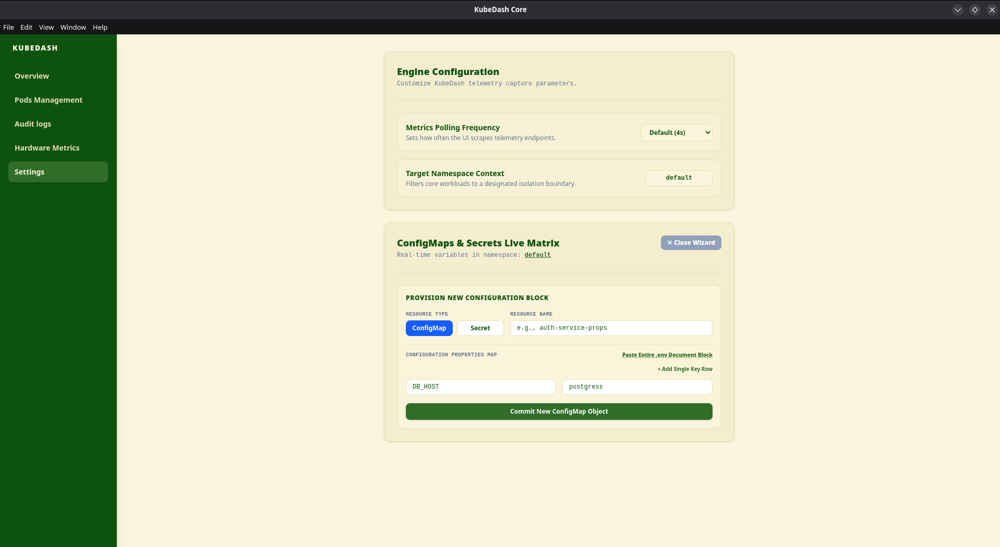

## Pods Table

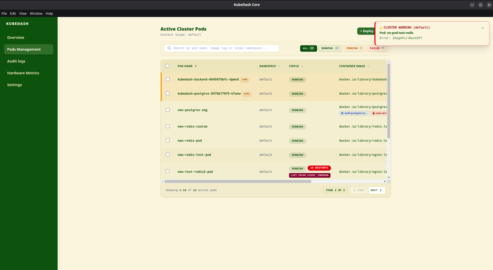

A central control hub that tracks pod metadata (name, namespace, status, image and age)

- Contextual badges: Spot attached ConfigMaps or Secrets (clickable for detail inspection), restart counts and crash root cause (e.g. ImagePullBackOff)
- Interactive actions: Quick action buttons to delete (graceful termination), launch a SSH terminal, open an isolated logs stream or trigger a restart

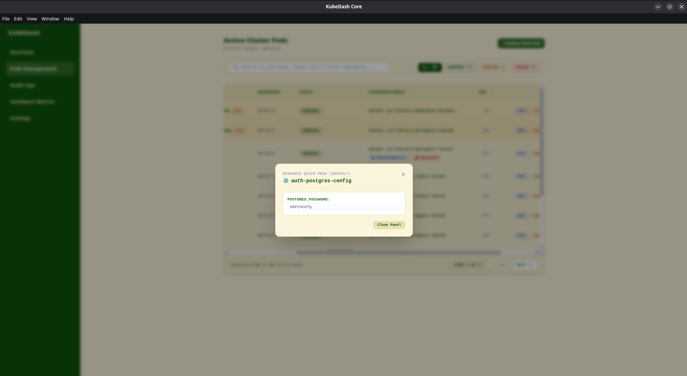

## Audit Table

Splits administrative tracking into three data layers:

- Active clusters logs (PostgreSQL DB): standard searchable logs with paginated tables and filtes for severity. You can also set how many logs per page you can see.

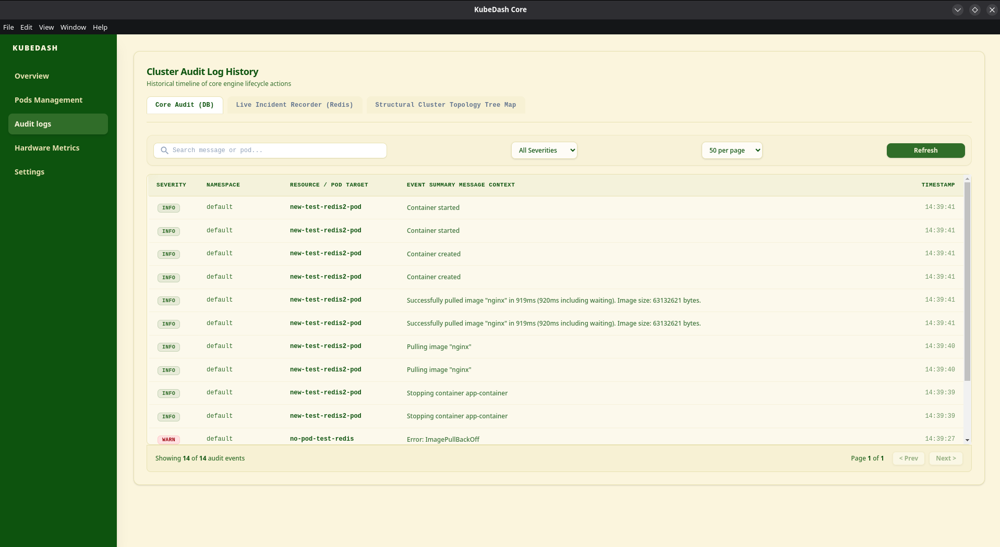

- Historical clusters failures logs (Redis cache): deep archive tracking cluster faults that can be older than 2 hours, saving long-term failure trends

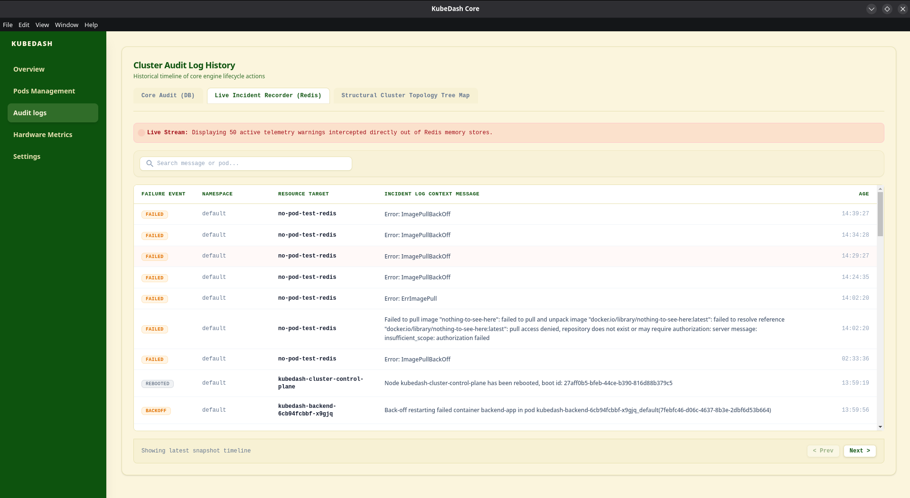

- Topology map: showing a layout map of the cluster (ingress, service and deployment nodes) with clickable nodes to show details. For deployments, you can restart or see logs too
  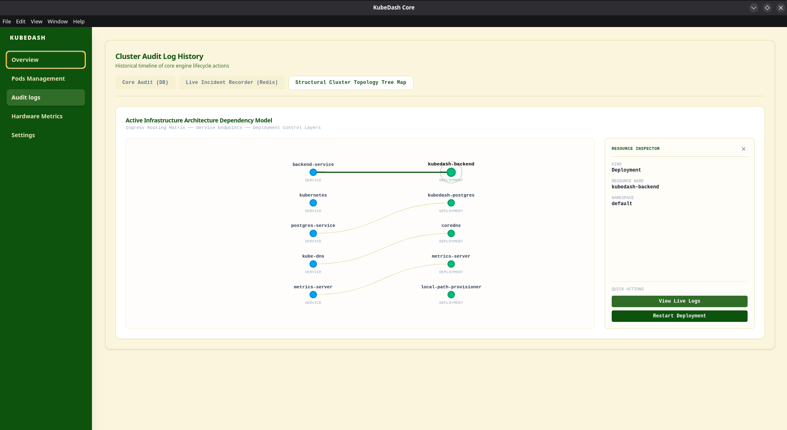

## Hardware metrics

This is powered by a local Kubernetes metrics server to get hardware metrics over running pods.

I used:

```sh
kubectl apply -f https://github.com/kubernetes-sigs/metrics-server/releases/latest/download/components.yaml
kubectl patch deployment metrics-server -n kube-system --type='json' -p='[{"op": "add", "path": "/spec/template/spec/containers/0/args/-", "value": "--kubelet-insecure-tls"}]'
```

The page has a header with two main components:

- Summary of consumtion: at the top of the page, there is the number of managed pods, aggregated CPU load, total RAM Allocation and GPU compute (avg utilization)
- Hog resources: top 3 pods that use the most CPU and most Memory

This page has three separate analytical tabs:

- Live table: real time metrics breakdown over pods analyzing cpu load, RAM allocation, NVIDIA GPU COMPUTE and telemetry health
  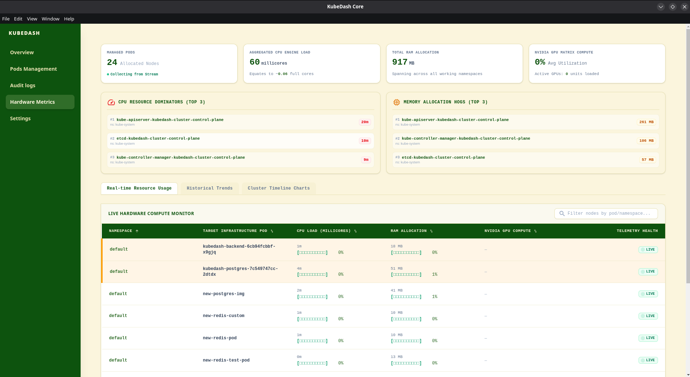

- Sparklines: live micro spikelines charts that outline sudden computational trajectory on immediate history trends
  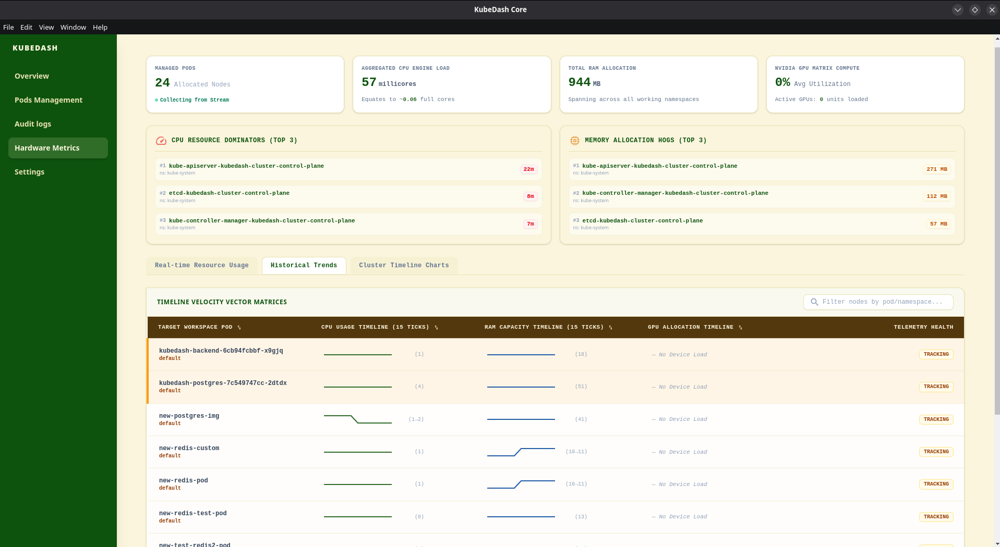

- Long-term charts: historical redis backed charts tracing CPU and Memory usage from the time it was initialized to present
  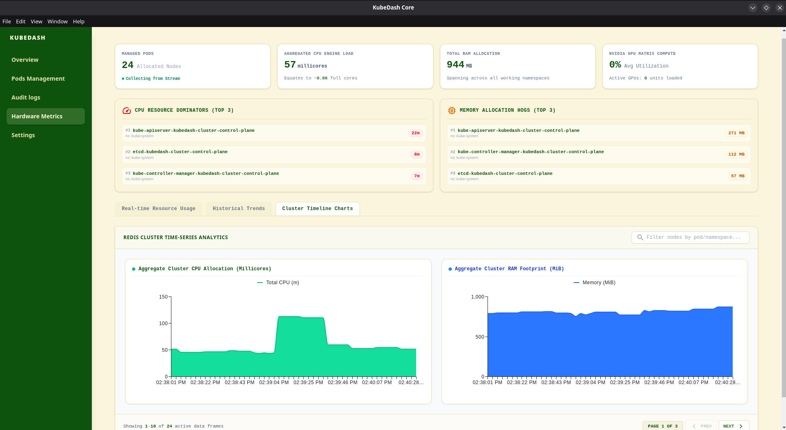
